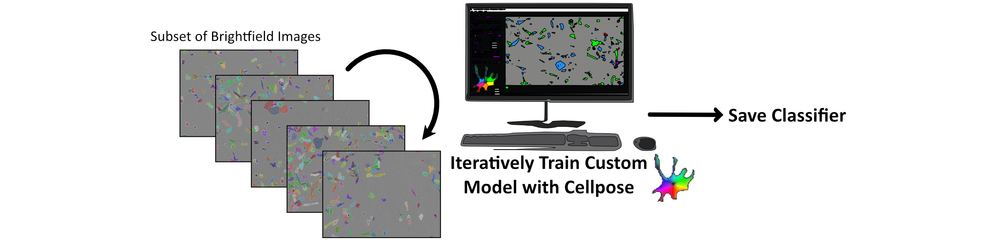
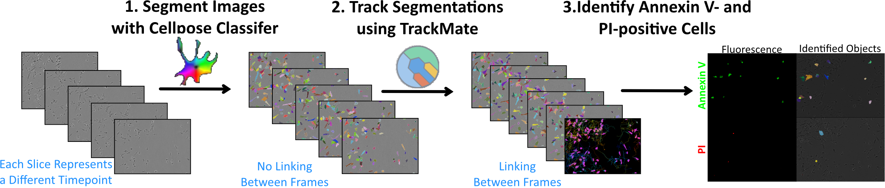
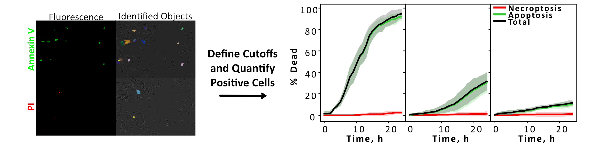

## Background

This code enables quantification of red- and green-positive cells from an Incucyte timelapse experiment

The code assumes single-timepoint and channel images (one brightfield image and two fluorescent channel images at each time point). Brightfield images of all time points are saved in one directory, channel 1 fluorescence in another, and channel 2 fluorescence in another.

- However, the code will be easily adaptable to start with stacks

The code is generalisable to any fluorescence channels, but this experiment (and therefore README) will assume green intensity = Annexin V and red intensity = PI

## Create Custom Cellpose Model (Optional)

- A small subset of brightfield images should be used to train a custom [Cellpose](https://www.cellpose.org/) model.
    - Depending on your cell type, one of the [standard models](https://cellpose.readthedocs.io/en/latest/models.html) may suffice
    - I recommend using the GUI to do this very easily (instructions [here](https://www.youtube.com/watch?v=5qANHWoubZU))
- Save your generated classifier for use within the Python code

## Code Explanation

1. Single-timeframe images are stacked and labels generated using Cellpose (Python). Labels are unlinked between frames. 
2. Stacked labels saved from (1) should be linked. In this code, we assume this is done separately using [TrackMate](https://imagej.net/plugins/trackmate/) in FIJI/ImageJ
    1. Depending on your experimental conditions and temporal resolution, [TrackPy](https://soft-matter.github.io/trackpy/v0.6.4/) may also be used so that all code remains within Python. However, TrackMate’s incorporation of shape metrics for matching made it more suitable for our experiment
3. Resultant tracked segmentations from (2) can be quantified and analysed in Python.

## Quantify Apoptotic/Necroptotic Cells

- Intensity thresholds can be based on either:
    1. Total fluorescence intensity within an identified cell (cell size dependent)
    2. Mean fluorescence intensity in the brightest n_mean pixels within the cell (cell size independent, cells with bright spots of intensity are identified)
- Only long tracks (identified cells that appear in more than percentage_of_frames_appeared_in% of frames) are quantified to avoid inclusion of noise and/or misidentified tracks
- Cells are defined as apoptotic when their green (AV) fluorescence exceeds a predefined threshold
- Cells are defined as necroptotic when their red (PI) fluorescence exceeds a predefined threshold, assuming that at no point the cell has previously been defined as apoptotic)

