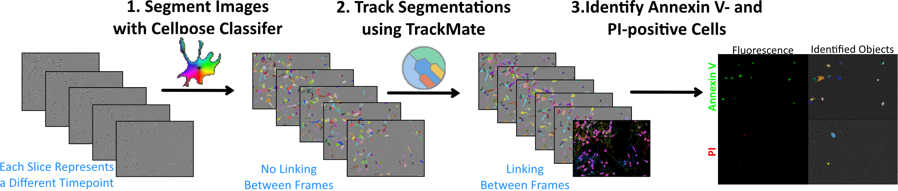
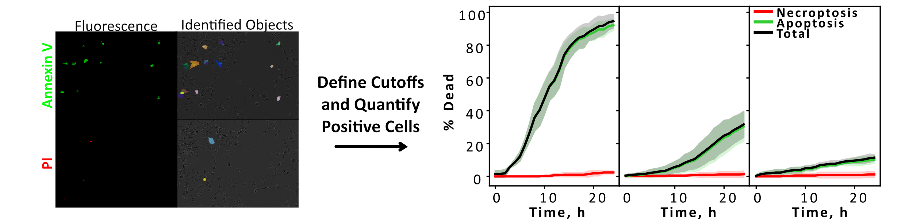
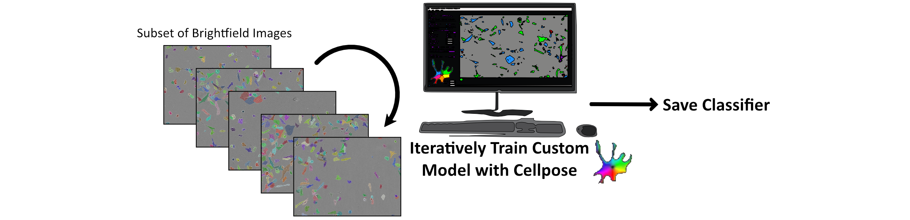

# FluoroFate

**A friendly, napari-based GUI for quantifying cell death and cell fate from multi-channel fluorescence timelapse images.**

FluoroFate takes your timelapse TIFF images and does the heavy lifting: it segments cells, tracks them across frames, thresholds your fluorescence channels, and classifies each cell's fate — all from within a point-and-click interface built on [napari](https://napari.org/). Results are exported as CSVs and publication-ready PDFs, and everything is visualised interactively so you can sanity-check as you go.

While originally developed for quantifying apoptosis (Annexin V) and necroptosis (PI) from Incucyte timelapse experiments, FluoroFate is generalisable to **any** fluorescence channels and cell fate question — including cell-cycle analysis with FUCCI reporters, or any experiment where you need to track which fluorophores appear in which cells over time.

---

## What Does FluoroFate Actually Do?

The pipeline has three main stages, each of which can be run independently or all at once:



1. **Segment cells with Cellpose** — Brightfield frames are segmented into individual cell masks using either a built-in Cellpose model or a custom one you've trained yourself. Each frame is processed independently, so at this stage cells don't yet have consistent identities across time.

2. **Track cells with TrackMate** — Cell identities are linked across frames using TrackMate's Advanced Kalman Tracker (run headlessly via [PyImageJ](https://pyimagej.readthedocs.io/) — no need to open FIJI). When splitting is enabled, division events are detected and a hierarchical lineage tree is built automatically.

3. **Threshold fluorescence and assign fates** — Up to 3 fluorescence channels are blurred (Gaussian) and auto-thresholded to produce binary positive-signal masks. Thresholded fluorescence blobs are assigned to tracked cells by centroid overlap — and then each cell gets classified based on which fluorophores it's positive for.

The end result? Percentage trajectory curves, spatial trajectory plots, cell timeline swimlane charts, and detailed per-cell CSVs — generated at multiple frame-presence cutoffs (30/40/50/60%) so you can see how sensitive your results are to short-lived tracks.



---

## Before You Start

> **Already comfortable with Python?** All you need to do is create the conda environment from `fluorofate_environment.yml`, activate it, and run `fluorofate.ipynb` or `python fluorofate.py` in your preferred editor or terminal. The step-by-step guide below is aimed at people who haven't done this before.

The instructions below walk you through setting up everything in **VS Code** — a free code editor that makes it easy to run notebooks even if you've never written a line of code. We'll go through each step in detail so nothing is left to guesswork.

### 1. Install conda

If you don't already have it, install [Miniconda](https://docs.conda.io/en/latest/miniconda.html). You don't need the full Anaconda distribution — Miniconda is smaller and has everything we need.

Run the installer and accept the defaults. Once it's finished, you should be able to open **Anaconda Prompt** from the Start menu (Windows) or run `conda` in any terminal (Mac/Linux).

### 2. Install VS Code

Download and install [Visual Studio Code](https://code.visualstudio.com/) (it's free). Once it's open:

1. Go to the **Extensions** panel (the square icon on the left sidebar, or press `Ctrl+Shift+X`).
2. Search for and install the **Python** extension (by Microsoft).
3. Search for and install the **Jupyter** extension (by Microsoft).

These two extensions let VS Code run Python notebooks — which is how we'll launch FluoroFate.

### 3. Create the environment

Open a terminal inside VS Code (**Terminal → New Terminal** from the menu bar, or press `` Ctrl+` ``). Then navigate to this folder and create the environment:

```bash
cd path/to/Annexin_V_Incucyte_Analysis
conda env create -f fluorofate_environment.yml
```

Replace `path/to/Annexin_V_Incucyte_Analysis` with the actual path to this folder on your computer. This installs everything FluoroFate needs — Python, napari, Cellpose, PyImageJ, Java, and all the scientific libraries — into a self-contained environment called `fluorofate_environment`. You only need to do this once.

### 4. Select the environment in VS Code

1. Open the file `fluorofate.ipynb` in VS Code (File → Open File, or drag it in).
2. In the top-right corner of the notebook, you'll see a **kernel picker** (it might say "Select Kernel" or show a Python version). Click it.
3. Choose **Python Environments → fluorofate_environment**. If it doesn't appear immediately, click "Refresh" or restart VS Code.

This tells VS Code to use the environment you just created — with all the right packages installed.

### 5. Launch FluoroFate

With `fluorofate.ipynb` open and the `fluorofate_environment` kernel selected, just click the **Run All** button at the top of the notebook (the double-play icon ▶▶). The FluoroFate GUI will open in a napari window and you're ready to go.

### Input Format

FluoroFate expects a **4-D TIFF** with shape `(T, C, Y, X)` — time, channels, height, width. You'll need at least one brightfield channel and one fluorescence channel. Supported extensions: `.tif`, `.tiff`.

---

## Training a Custom Cellpose Model (Optional)

Depending on your cell type, one of the [standard Cellpose models](https://cellpose.readthedocs.io/en/latest/models.html) (like `cyto3` or `nuclei`) might work perfectly well out of the box. But if your cells are tricky to segment, training a custom model is straightforward and makes a big difference.



Here's the gist:

- Grab a small subset of your brightfield images (a handful is usually enough)
- Open them in the [Cellpose GUI](https://www.cellpose.org/) and iteratively train a custom model — there's a great [video walkthrough here](https://www.youtube.com/watch?v=5qANHWoubZU) that makes the process very easy to follow
- Save your trained model (`.pt` or `.pth` file) — you'll point FluoroFate at it later

An example custom model is included in the `Example_Custom_Cellpose_Model` folder if you'd like to see what one looks like.

To use your model in FluoroFate: in the **Analysis** panel, click the file picker next to **Select file (optional custom model)** and choose your file. The built-in model dropdown will automatically disable itself.

---

## How the GUI Is Organised

The GUI is split into configuration panels on the right side of the napari viewer. Here's what each panel does:

### Files

| Parameter | Description |
|---|---|
| Single TIFF | Path to one multi-channel timelapse TIFF |
| Batch folder | Folder of TIFFs (only needed for batch mode) |
| Output directory | Where results are saved (defaults to a subfolder next to the image) |

### Channels

This is where you tell FluoroFate about your fluorescence channels. You can configure up to 3 fluorophores, each with its own name, channel index, and thresholding method. The names you choose here are used in all output files and plots — so pick something meaningful.

| Parameter | Default | Description |
|---|---|---|
| Brightfield channel | -1 (last) | Channel index for brightfield |
| Fluorophore 1 name | Green | Name used in output columns/files |
| Fluorophore 1 channel | 0 | Channel index |
| Fluorophore 1 threshold | otsu | Thresholding method for this channel |
| Fluorophore 2 name | Red | Name used in output columns/files |
| Fluorophore 2 channel | 1 | Channel index |
| Fluorophore 2 threshold | otsu | Thresholding method for this channel |
| Fluorophore 3 name | *(blank)* | Leave blank to skip this channel |
| Fluorophore 3 channel | 2 | Channel index |
| Fluorophore 3 threshold | otsu | Thresholding method for this channel |

### Analysis

| Parameter | Default | Description |
|---|---|---|
| Analysis mode | persistent | `persistent` or `snapshot` — see [Analysis Modes](#analysis-modes-explained) below |
| Blur sigma | 1.0 | Gaussian blur sigma applied before thresholding (smooths noisy fluorescence) |
| Custom model file | *(empty)* | Optional `.pt`/`.pth` Cellpose model; overrides the built-in model |

### Cellpose

| Parameter | Default | Description |
|---|---|---|
| Model | cpsam | Built-in model (auto-disabled when a custom model is selected) |
| Min cell size | 15 | Minimum object size in pixels — anything smaller gets filtered out |
| Use GPU | True | Enable GPU acceleration (highly recommended if available) |

### TrackMate

| Parameter | Default | Description |
|---|---|---|
| Init search radius | 30.0 | First-frame linking distance (how far to look for initial matches) |
| Search radius | 150.0 | Kalman filter search radius for subsequent frames |
| Max frame gap | 3 | How many frames a cell can disappear before the track is closed |
| Allow splitting | False | Permit cell division events (builds a lineage tree) |
| Splitting max distance | 15.0 | Maximum distance for splitting links (only used when splitting is enabled) |
| Allow merging | False | Permit cell fusion events |

---

## Running the Pipeline

You can run stages individually (useful for debugging or re-running just the analysis with different settings) or all at once:

| Button | What it does |
|---|---|
| **1) Run Segmentation** | Runs Cellpose segmentation only; saves `masks_stack.tiff` |
| **2) Run Tracking** | Runs TrackMate on saved masks; saves `linked_labels_trackmate.tiff` and `trackmate_tracks.csv` |
| **3a) Run Persistent Analysis** | Runs persistent fate assignment + generates plots from saved tracking |
| **3b) Run Snapshot Analysis** | Runs snapshot fate assignment + generates plots from saved tracking |
| **Run All (Single Image)** | Full pipeline on one image — segmentation, tracking, then both analysis modes |
| **Analyse All in Folder** | Batch mode: processes every TIFF in a folder and saves a combined `batch_summary.csv` |
| **Save Results** | Export accumulated result rows to a CSV you choose |

Running stages individually is handy when you want to tweak analysis settings without re-segmenting and re-tracking — since those steps take the most time.

---

## Analysis Modes Explained

FluoroFate supports two fundamentally different ways of classifying cells. Which one you choose depends on the biology you're studying.

### Persistent Mode

Each cell is assigned the fate of whichever fluorophore's threshold is exceeded **first** across the timelapse. Once assigned, the fate is permanent — the idea being "once dead, stays dead."

This is the right choice when the **order** of fluorescence appearance tells you something biologically meaningful. For example:
- A cell that becomes Annexin V-positive first → **apoptosis**
- A cell that becomes PI-positive first (without prior Annexin V) → **necroptosis**

The percentage curves in persistent mode can only go up over time, since fates are irreversible.

### Snapshot Mode

Each cell is classified **independently at every frame** based on which fluorophores are currently active. Categories are formed by combining active fluorophore names (e.g. `Annexin_V`, `PI`, `Annexin_V+PI`, `negative`).

This is the right choice for experiments with **reversible or cyclical** states — for example, FUCCI cell-cycle reporters where cells move between G1 (red) and S/G2/M (green) phases.

The percentage curves in snapshot mode can go both up and down, since a cell's classification can change from frame to frame.

---

## Thresholding Methods

Each fluorophore channel can use a different auto-thresholding method, configured in the Channels panel. FluoroFate applies a Gaussian blur (controlled by the blur sigma parameter) before thresholding to smooth out noise.

| Method | When to use it |
|---|---|
| **mean** | Good general-purpose default — pixels above the image mean intensity are positive |
| **otsu** | Classic choice for bimodal histograms (clear separation between background and signal) |
| **yen** | Maximises correlation of original vs thresholded image — works well for a range of conditions |
| **triangle** | Best for unimodal histograms with a tail (lots of background, sparse bright signal) |
| **minimum** | Histogram-based minimum method — assumes a bimodal distribution |

If you're not sure which to use, `mean` is a sensible starting point. You can always re-run just the analysis step (3a or 3b) with a different method without needing to re-segment or re-track.

---

## Quantifying Cell Fate

Under the hood, FluoroFate links fluorescence signal to tracked cells using a centroid-based approach: for each thresholded fluorescence blob, the centroid pixel is checked against the tracked cell label image to determine which cell "owns" that signal. The positive area (number of thresholded pixels) is recorded per cell per frame.

Only long-lived tracks — cells that appear in more than a configurable percentage of frames — are included in the filtered output plots. This avoids noise from transiently detected objects or misidentified tracks. The unfiltered CSVs always include every tracked cell, so you can apply your own filters downstream if you prefer.

Filtered outputs are generated at **30%, 40%, 50%, and 60%** frame-presence cutoffs, so you can see how robust your results are.

---

## Output Files

All outputs are saved in a per-image subfolder under the output directory. Here's what you'll find:

### Segmentation & Tracking

| File | Description |
|---|---|
| `masks_stack.tiff` | Cellpose segmentation masks (T, Y, X) |
| `linked_labels_trackmate.tiff` | Tracked labels with consistent cell IDs across frames |
| `trackmate_tracks.csv` | Track positions: `track_id`, `t`, `y`, `x`, `quality`, plus `lineage_id`, `parent_track_id`, `generation` columns |
| `trackmate_tracks_by_cell.csv` | Same data with additional `cell_id` (= track_id + 1) and `frame` columns for convenience |
| `lineage_summary.csv` | One row per track: lineage ID, parent track, generation, first/last frame, number of frames |

### Persistent Mode

| File | Description |
|---|---|
| `assignments_persistent.csv` | Per-cell fate, first-positive frame, and positive area per fluorophore |
| `persistent_by_cell.csv` | Same with `cell_id`, `track_id`, and lineage columns |
| `percentages_persistent.csv` | Cumulative % positive cells per frame |
| `percentages_persistent.pdf` | Line plot of cumulative percentages |
| `percentages_persistent_{N}pct.csv/pdf` | Same, filtered to cells present in ≥N% of frames (N = 30, 40, 50, 60) |

### Snapshot Mode

| File | Description |
|---|---|
| `snapshot.csv` | Per-cell per-frame category, boolean flags, and positive area per fluorophore |
| `snapshot_by_cell_long.csv` | Long format with `cell_id`, `track_id`, `frame`, `category`, and lineage columns |
| `snapshot_by_cell_wide.csv` | Wide format: one row per cell, one column per frame's category, plus lineage columns |
| `percentages_snapshot.csv` | Per-frame category percentages |
| `percentages_snapshot.pdf` | Line plot of category percentages |
| `percentages_snapshot_{N}pct.csv/pdf` | Filtered to cells present in ≥N% of frames |
| `snapshot_trajectories_{N}pct.pdf` | Spatial trajectory plots coloured by category |
| `snapshot_timelines_{N}pct.pdf` | Swimlane timeline plots showing each cell's category over time |

### A Few Things Worth Knowing About the Outputs

- **All CSVs include every tracked cell**, regardless of how many frames it appears in. The frame-presence filtering (30/40/50/60%) is only applied to the cutoff-specific plots and CSVs.
- **Positive area columns** (`{fluorophore}_positive_area`) report the number of thresholded positive pixels overlapping each cell mask — per fluorophore, per frame (snapshot) or summed across all frames (persistent).
- **Lineage columns** (`lineage_id`, `parent_track_id`, `generation`) are included when TrackMate splitting is enabled. Lineage IDs use dotted notation (e.g. `1`, `1.1`, `1.2`) so mother and daughter cells can be grouped together.

---

## Code Structure

FluoroFate is organised into focused modules. If you want to use parts of the pipeline programmatically (e.g. in a notebook) or extend the code, here's what lives where:

| Module | What it does |
|---|---|
| `fluorofate.py` | Main GUI application — `FluoroFateApp` class, napari viewer, all button callbacks |
| `segmentation.py` | Cellpose frame-by-frame segmentation (`cellpose_live_segmentation`) and fluorescence thresholding (`segment_fluorescence`) |
| `tracking.py` | TrackMate integration via PyImageJ (`generate_trackmate_labels`) and lineage tree construction |
| `measurement.py` | Morphology measurements (`measure_all_cells_in_frame`) and fluorescence-to-cell assignment by centroid overlap (`compute_cell_positivity`) |
| `fate_assignment.py` | Persistent and snapshot fate classification, percentage curve computation, and frame-presence filtering |
| `plotting.py` | Publication-quality matplotlib/seaborn plots: percentage trajectories, spatial trajectories, swimlane timelines |
| `colours.py` | Automatic colour inference from fluorophore names (e.g. "PI" → red, "Annexin_V" → green) for both matplotlib and napari |
| `utils.py` | Small helpers: notebook detection (`running_in_notebook`) and Java/JVM configuration (`configure_java_home`) |

---

## Tips and Troubleshooting

- **GPU acceleration** is highly recommended for Cellpose segmentation. If you don't have a CUDA-capable GPU, it will still work — just slower.
- **Java not found?** Make sure you have a JDK installed and accessible. Installing `jdk4py` via pip or using a conda environment with `openjdk` usually sorts this out.
- **Tweaking analysis without re-segmenting:** Since each stage saves its intermediate outputs (`masks_stack.tiff`, `linked_labels_trackmate.tiff`), you can re-run just the analysis stage (buttons 3a/3b) with different thresholding methods or parameters. This saves a lot of time.
- **Batch mode** processes every TIFF in a folder with the same settings and produces a combined `batch_summary.csv` alongside the per-image outputs.
- **Colour assignment** is automatic based on fluorophore names — if your channel name contains "red", "green", "blue", etc., FluoroFate will pick matching colours for plots and napari layers. Unknown names get unused colours from a default palette.
