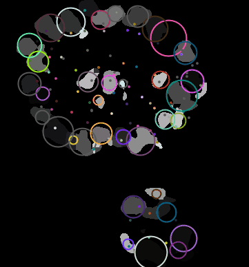
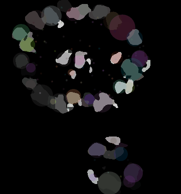
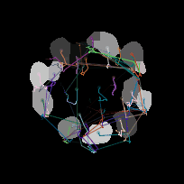
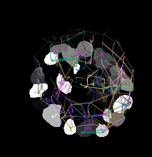
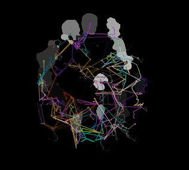
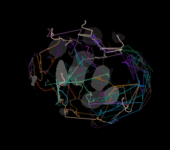
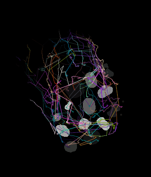
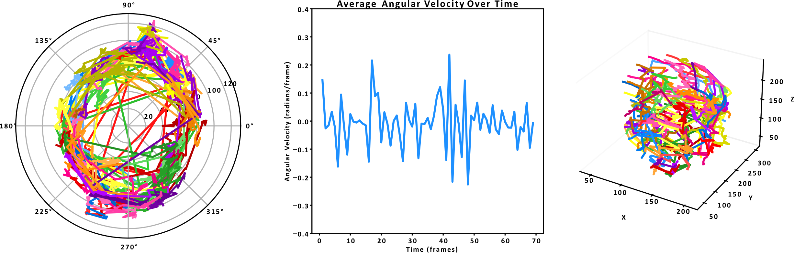

# Create classifiers for nuclear segmentation (optional, FIJI/ImageJ)
I’ve provided a [top](https://github.com/isobelth/image_quantification/blob/main/CD7_Tracking_Cells_in_Acini_Timelapse/example_top_classifier.classifier) and [bottom](https://github.com/isobelth/image_quantification/blob/main/CD7_Tracking_Cells_in_Acini_Timelapse/example_bottom_classifer.classifier) classifier that you can try. Ideally, the same classifier could be applied to all timelapse images. However, in theory, the different images may have different intensity characteristics, so you may need to create additional classifiers.

**Background:**

*A significant challenge encountered during the acquisition of large z-stacks of acini using confocal microscopy was the signal attenuation in deeper z-slices, a common limitation when imaging thick specimens. This signal drop-off results from the increasing distance from the confocal microscope's detector, affecting the consistency of fluorescence intensity across the stack. To address this issue, rather than adjusting the capture settings to compensate for signal drop-off (which proved to be excessively time-consuming and incompatible with high-throughput requirements), the image stacks were divided into two distinct subsets: one comprising the brighter upper slices and the other encompassing the dimmer, deeper slices.*

*The FIJI plugin [Labkit](https://imagej.net/plugins/labkit/) was used to segment the resulting substacks. Separate classifiers were trained for each substack,  tailored to recognise the unique intensity characteristics of the brighter and dimmer halves. Sparse manual labels were created, which served as the foundation for training the random forest classifiers for each substack. This method allowed for efficient segmentation even in instances of low signal intensity, where traditional threshold-based methods would falter due to the variability in fluorescence across the stack. Resulting segmentations were combined to create a z-stack for nuclear segmentation across the stack. This approach ensured that segmentation quality was maintained across varying levels of fluorescence intensity, facilitating a more precise and reliable analysis of cellular and nuclear morphologies.*

**How to make the classifiers:**

1. Open the image you want to segment in FIJI/ImageJ.
2. Use the “Duplicate” command to separate a single timepoint nuclear channel, then split the stack in half.
3. Run [Labkit](https://imagej.net/plugins/labkit/) and create a classifier for each half (pressing “s” in Labkit opens the brightness and contrast settings if you need to alter these in segmentation)

For each stack, the segmentation training process will look as follows:

Try to get the segmentation as close as possible to the ground truth without overfitting.

## Run the segmentation (FIJI/ImageJ)

1. Use the FIJI/ImageJ [macro](https://github.com/isobelth/image_quantification/blob/main/CD7_Tracking_Cells_in_Acini_Timelapse/Labkit_Split_and_Segment.ijm) provided to run the segmentations
2. You can run the macro on a whole folder: it will search for all files of a certain type (e.g. tif), split them into a top and bottom section, and separate out the timesteps before segmenting.
3. You will be left with 2*T top binary segmentations and 2*T bottom binary segmentations

## Stack the segmentations (FIJI/ImageJ)

1. I’ve provided a [macro](https://github.com/isobelth/image_quantification/blob/main/CD7_Tracking_Cells_in_Acini_Timelapse/Concatenate_Top_and_Bottom_Stacks.ijm) to stack the top and bottom halves back into a combined stack. This can be done for all timelapse images at once. You need to move all the resultant “top” segmentations to one folder and all the “bottom” segmentations to another folder. The concatenated segmentations will be saved in another folder.

## Concatenate the files and create unlinked labels (Python)

1. This [.ipynb](https://github.com/isobelth/image_quantification/blob/main/CD7_Tracking_Cells_in_Acini_Timelapse/CD7_Tracking_Cells_in_Acini_Timelapse_README.md) file restacks the individual timepoints into large stacks
2. Labels are created and cleaned, and a Watershed transform is applied to separate touching objects. It would be great if you could play around with parameters here to get the best match between labels and ground truth. This may require you changing the seed distance to more/less harshly split touching nuclei.

1. Labels are identified at each timestep, but there is no linking of nuclei between timesteps

## Create linked labels in Trackmate (FIJI/ImageJ)

1. The following parameters work well in [Trackmate](https://imagej.net/plugins/trackmate/) for MCF10A acini. [Trackpy](https://pypi.org/project/trackpy/) can be used instead if you want to keep everything in Python. However, Trackmate performs matching, taking into account shape and not just position.
    - separation = 10
    - Kalman tracker:
    - initial search radius = 30
    - search radius = 150
    - max frame gap = 3 frames
    - feature penalties: radius, x, ,y z = 1
    - no splitting
2. This will convert from unlinked labels to labels that are linked between frames (timesteps)

  
  

  
  
  
  
  

## Quantify Motion (Python)
Quantify individual cell motion and rotation compared to the (often drifting!) acinar COM

