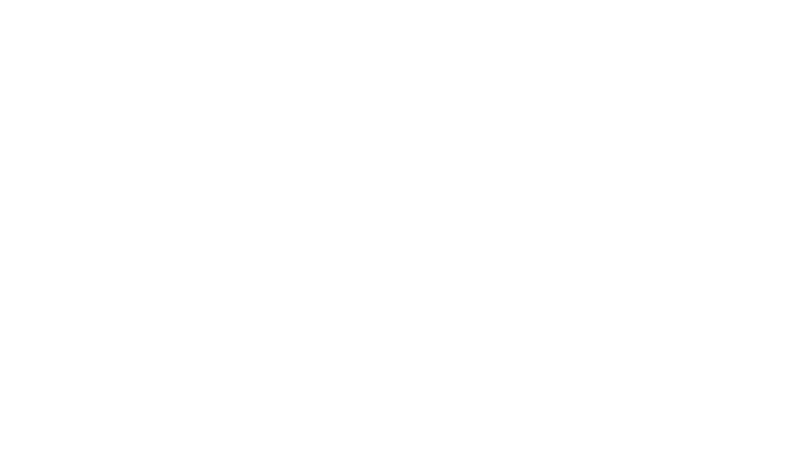
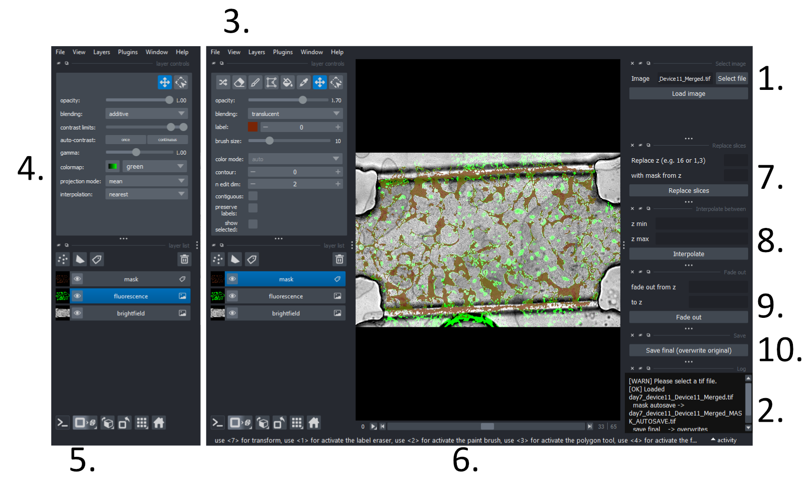

# Label Generation Steps

1. Gather paired brightfield + fluorescent images
2. Use a deep learning model and sparse labelling to create a mask (Bel will do this). Stack the images into a 3-channel stack:
   - Channel 0: Brightfield, Channel 1: Fluorescence, Channel 2: Mask
   - Images saved in `Z:\Bel\IMAGES_FOR_VASCUMAP_RETRAINING\fluorescent_cells_tifs\3_channel_images_to_curate`
3. Use the GUI in this python code to curate the masks
4. (Hopefully!) use the brightfield and curated masks to train a deep learning model to segment vasculature directly from the brightfield images

# How to Use This Code

1. If you've ever used the permeability/placenta code, you already have VS code and the relevant environment installed, so you can skip ahead to step 7
2. Install Visual Studio (VS) Code from: https://code.visualstudio.com/
3. Install Miniconda using this installer: https://docs.conda.io/en/latest/miniconda.html
   - Make sure you check the "Add Miniconda to my PATH environment variable"
4. Open Visual Studio Code. On the top menu, select Terminal → New Terminal. When the terminal pops up, make sure it says Command Prompt and not Powershell
   - You can check that miniconda is installed by typing `conda --version` in the terminal. If you see a number, conda is working! Chat to Bel if you get an error here!
5. Click on the `environment.yml` file in this directory and press download. Save it to a designated Python folder. In VS code, go to File -> Open Folder -> Select your designated folder
6. In your terminal, write the following (pay attention to spaces!) and press enter: `conda env create -f environment.yml`
   - Lots of stuff will appear in the terminal, allow it to install (you might have to type `a` and press enter to agree to the conditions
7. Download the label_curation.ipynb file from this directory and save it to your designated Python folder. Click on it in VS code and select the newly installed terminal (nap-ij) in the top right
8. You might have to press `python environments` to see it listed
9. Press the `Run All` button at the top of the file. The GUI should open in a new window
    
# How to Use The GUI

