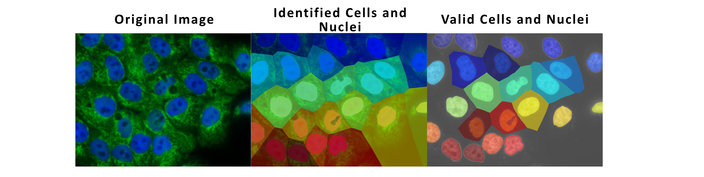
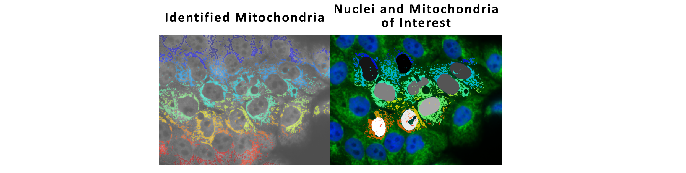
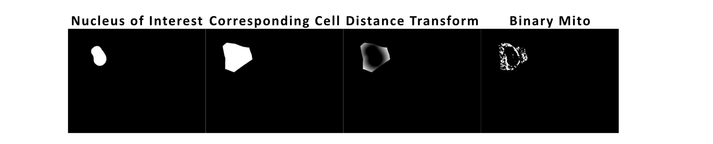
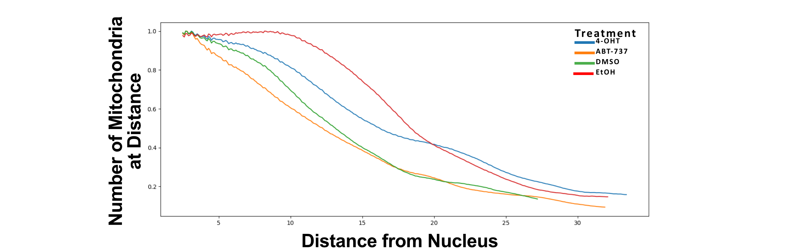

# Quantification of Mitochondria within Cells in a 2D Monolayer

## Background

- This code provides quantification of mitochondria in cells in 2D monolayers. Quantification includes:
    - (Approximate) cell area
    - Mitochondrial area
    - Mitochondrial/cell area
    - Distribution of mitochondria from nuclear edge
- This requires fluorescent images containing (at least) a nuclear and a mitochondria channel
- In our experiment, it was not possible to acquire a membrane channel. Therefore cell boundaries were approximated as the midway point between neighbouring nuclei

## Segmentation Method

- Cell nuclei were segmented and binarised using an Otsu threshold
- Neighbouring nuclei were separated using a watershed algorithm

- As it was not always possible to acquire images with a membrane marker, cell boundaries were approximated by expanding nuclear labels without overlap until they filled the image.
    - Any segmented cells touching the image border were discarded from the analysis.
    - Any cells containing nuclei above a threshold area were discarded from analysis (cells assumed to be in M-phase)
    
    
    
- Mitochondria are segmented with an optional background removal step
    
    
    

# Quantification

- The number and area of mitochondria in each cell is calculated.
- A distance transform is applied to each cell to calculate the shortest Euclidean distance between every point in the cytoplasm and the nucleus. This enabled calculation of the number of pixels at each distance from the nucleus occupied by mitochondria.

