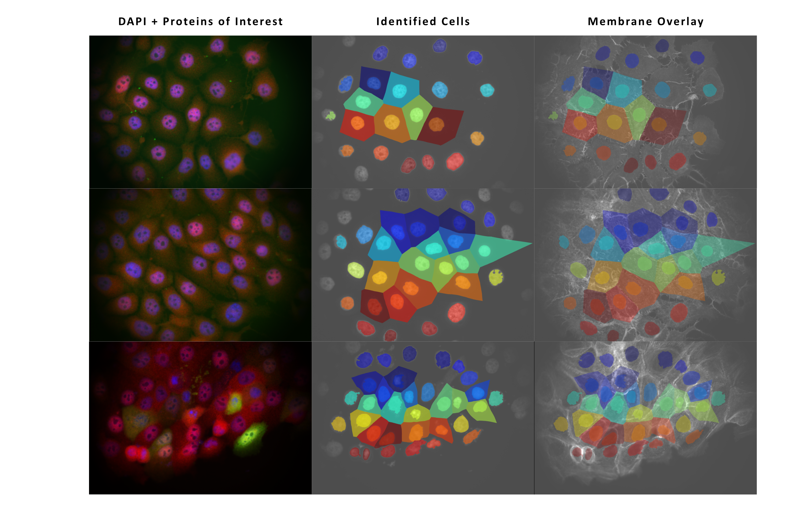

# Quantification of Subcellular Localisation of Proteins within Cells in a Confluent 2D Monolayer

## Background

- This code provides quantification of proteins of interest in cells in 2D confluent monolayers. Quantification includes:
    - Nuclear protein(s) of interest
    - Cytoplasmic protein(s) of interest
    - Nuclear/Cytoplasmic protein(s) of interest
    - Total Nuclear/Cytoplasmic protein(s) of interest
- This requires fluorescent images containing (at least) a nuclear and a protein of interest channel
- In our experiment, treatment with ROCKi and myosin-IIi disrupted cell membranes. Therefore cell boundaries were approximated as the midway point between neighbouring nuclei

## Segmentation Method

- Cell nuclei were segmented and binarised using an Otsu threshold
- Neighbouring nuclei were separated using a watershed algorithm

- Cell boundaries were approximated by expanding nuclear labels without overlap until they filled the image.
    - Any segmented cells touching the image border were discarded from the analysis.
    - Any cells containing nuclei above a threshold area were discarded from analysis (cells assumed to be in M-phase)
    

