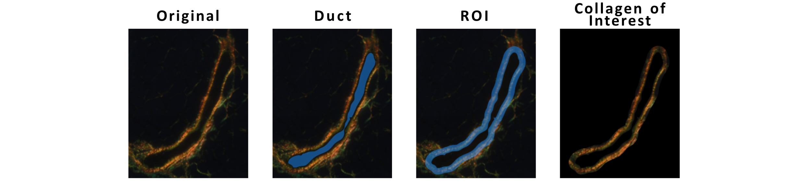
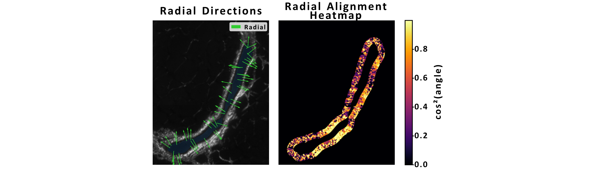

# Picrosirius Red Collagen Analysis
## Background

- This code provides tools to analyse picrosirius red-stained histological images and quantify:
    1. Collagen content
    2. Collagen type: red (thicker, bundled, tightly packed fibres) or green (loosely packed, thinner fibres)
    3. Collagen fibre alignment relative to ductal structures (radial vs tangential)
- The pipeline segments ducts, defines a periductal ring of interest, classifies birefringent collagen by hue, and quantifies collagen fibre orientation using structure tensor analysis.
- This pipeline is designed for polarised light microscopy images of picrosirius red-stained tissue sections.

## Methods

**Duct Identification:** Ducts are identified by contrast clipping, smoothing, and subsequent thresholding. Identified objects have their borders simplified by spline-smoothed contouring. Subsequent analysis considers only collagen within a narrow periductal region.

**Collagen Type Analysis (Red:Green Ratio):** Using a HSV conversion, collagen is [defined](http://www.jms.periodikos.com.br/article/587cb4587f8c9d0d058b460c/pdf/jms-22-2-587cb4587f8c9d0d058b460c.pdf) as red (hue < 0.05 or > 0.95) or green (hue ∈ (0.25, 0.45)). A red:green ratio is computed within the ring mask to estimate collagen composition.

- The hut of birefringent signal under polarised light correlates with fibre type and maturity. By converting RGB images to HSV, hue thresholds can be applied to distinguish collagen types.

**Fibre Orientation Analysis:** Fibre orientations are estimated using the structure tensor of a smoothed grayscale image. Alignment relative to the duct is computed as cos²(θ) between the fibre and radial vector at each point. The mean cos²(θ) across the ring is computed to indicate global radial alignment

- The structure tensor is used to estimate fibre orientation at each pixel within the ring of interest

