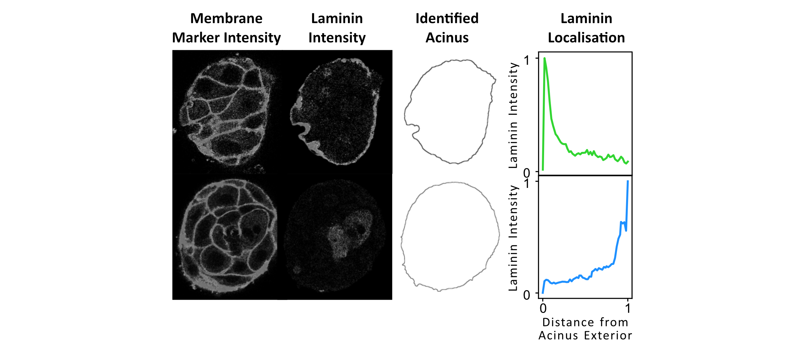

## Quantifying Protein Polarisation in Acini
This code was developed to quantify the distribution of a basement membrane protein (laminin) from the exterior of an acinar cellular aggregate and show loss of polarisation in certain experimental conditions. However, it can be used to quantify the distribution of any fluorescently tagged protein compared to a cellular aggregate.

The code assumes a multi-channel image (2D slice or 3D stack code versions available) that contains:
    1. Channel for protein of interest
    2. Channel for nuclear marker and channel for membrane/cytoplasmic marker
        - These will be combined to approximate the acinar extent

The most extreme phenotypic differences can be characterised using the protein localisation peaks below. Well-polarised acini display a sharp intensity peak at the exterior, rapidly diminishing toward the acinus centre (green). Disorganised acini exhibit less uniform intensity curves with sporadic peaks within the acinus interior. Fully depolarised acini exhibit intensity traces that increase with increasing distance from acinus exterior (blue).

## Segment Acinus

1. The acinar volume is approximated by combining the nuclear and membrane fluorescence intensity images and clipping to reduce the dynamic range. A Gaussian filter is used to smooth the images, and an Otsu threshold is applied to segment the binary image. Holes and small objects are removed.
2. In some instances, neighbouring acini have been imaged in one field of view. To distinguish individual acini, especially when they are merely proximal or superficially connected rather than genuinely forming a single, non-spherical entity, further processing steps are necessary. The sphericity of segmented objects, determined by the ratio of the second- to the zeroth-order eigenvalues of the inertia tensor, help to identify such instances. Low sphericity of identified objects indicates that the segmentation might have erroneously combined multiple neighbouring acini into one. To address this, morphological erosion is employed as a refinement step to effectively separate proximal acini without mistakenly dividing acini that were inherently non-spherical.
4. Following this correction, only the largest acinus identified was quantified and included in subsequent analysis. 

## Quantify Protein-of-Interest Localisation Compared to Acinus Exterior

1. A distance transform is used to calculate the shortest Euclidean distance between each point within the identified acinus and its boundary.

2. Protein-of-interest intensity outside the identified acinar region is set to 0 to avoid the inclusion of protein-of-interest from adjacent acini in the analysis.
3. The average protein-of-interest intensity at each distance from the acinus exterior is calculated, and the distance from the acinus exterior and average intensity are both normalised between 0 and 1 for each acinus.
    1. We did not see protein-of-interest secretion into the basal ECM, so this region is not included in the analysis. However, a negative distance map could be incorporated to quantify basal secretion.
