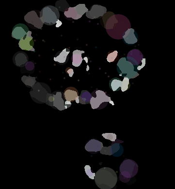
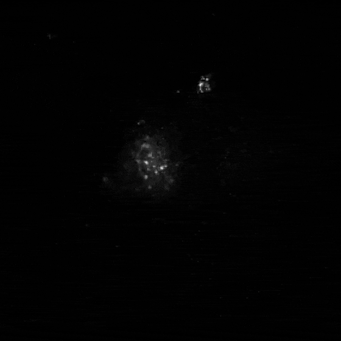
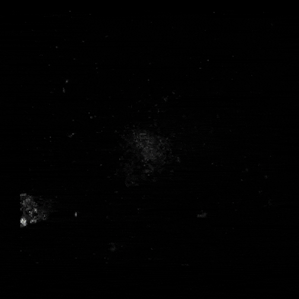
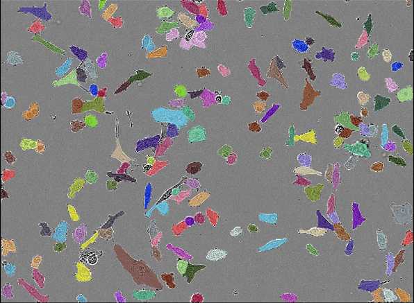

# Image Quantification Tools

This repository contains code to quantify cellular and tissue parameters from microscopy images.

It includes scripts for segmentation and analysis of:

- 2D and 3D fluorescent images
- 2D and 3D timelapse images (fluorescent + brightfield)
- Histological tissue slices

Each project folder contains a detailed README explaining what type of images the code is suitable for.

## About This Repository

This repository is a work in progress as I continue to compile and organise code from multiple projects I have been involved in.

New tools and workflows will be added over time, covering a broader range of microscopy analysis tasks.

## Collaboration and Contact

Please [reach out](https://www.linkedin.com/in/isobel-taylor-hearn-6766151b0/) if you have any questions, suggestions, or are interested in collaborating! 

  
  
  
  

