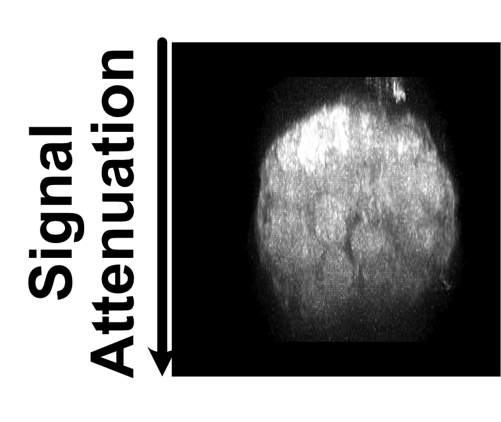
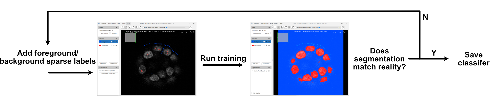
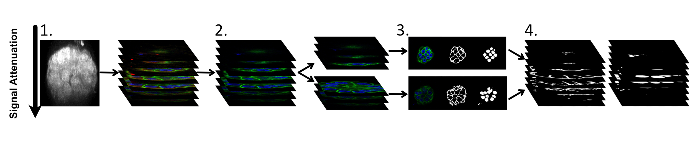
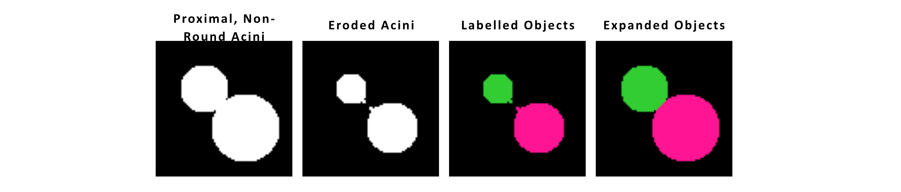
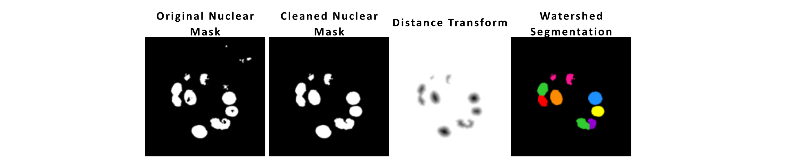

# Create classifiers for membrane and nuclear segmentation (FIJI/ImageJ)

**Background:**

*A significant challenge encountered during the acquisition of large z-stacks of acini using confocal microscopy was the signal attenuation in deeper z-slices, a common limitation when imaging thick specimens. This signal drop-off results from the increasing distance from the confocal microscope's detector, affecting the consistency of fluorescence intensity across the stack. To address this issue, rather than adjusting the capture settings to compensate for signal drop-off (which proved to be excessively time-consuming and incompatible with high-throughput requirements), the image stacks were divided into two distinct subsets: one comprising the brighter upper slices and the other encompassing the dimmer, deeper slices.*

*The FIJI plugin [Labkit](https://imagej.net/plugins/labkit/) was used to segment the resulting substacks. Separate classifiers were trained for each substack,  tailored to recognise the unique intensity characteristics of the brighter and dimmer halves. Sparse manual labels were created, which served as the foundation for training the random forest classifiers for each substack. This method allowed for efficient segmentation even in instances of low signal intensity, where traditional threshold-based methods would falter due to the variability in fluorescence across the stack. Resulting segmentations were combined to create a z-stack for nuclear segmentation across the stack. This approach ensured that segmentation quality was maintained across varying levels of fluorescence intensity, facilitating a more precise and reliable analysis of cellular and nuclear morphologies.*

**How to make the classifiers:**

1. In FIJI/ImageJ, open an example image to train the classifier on.
2. Use Duplicate (Ctrl + shift + D) to extract the membrane and nuclear channels only.
    1. We don’t want other intensity channels to influence the segmentation of cells and nuclei
3. Split the stack into a top (bright) and bottom (dim) half
4. Run [Labkit](https://imagej.net/plugins/labkit/) and create a classifier for the top half membrane, then separately for top half nuclear channel
    1. Pressing “s” in Labkit opens the brightness and contrast settings if you need to alter these in segmentation
5. Repeat step (4) for the bottom half of the stack
6. You should end up with 4 classifiers:
    1. Nuclear classifier to run on top (bright) halves of the stack
    2. Nuclear classifier to run on bottom (dim) halves of the stack
    3. Membrane classifier to run on top (bright) halves of the stack
    4. Membrane classifier to run on bottom (dim) halves of the stack

For each segmentation (e.g. top nuclear, bottom membrane…), the segmentation training process will look as follows:

Try to get the segmentation as close as possible to the ground truth without overfitting.

## Run the Segmentation and Concatenate the Results (FIJI/ImageJ)

1. Select a folder of images that you want to segment
2. Extract the membrane and nuclear channel from all your images and split them in half using the following [macro](https://www.dropbox.com/scl/fi/fzlqdfmcee5xmlwtntmex/extract_channel_1_4_topbottom.ijm?rlkey=i29w78r4y960flh7ykxcdlsz7&dl=0).
3. In FIJI/ImageJ, run the Labkit segmentation by selecting Plugins -> Labkit -> Macro Recordable -> Segment Images in Directory with Labkit
    1. You will need to run this four times for the four conditions (top images with top nuclear classifer, top images with top membrane classifer, bottom images with bottom nuclear classifier, bottom images with bottom membrane classifier)
4. Save all the “top” segmentations in one folder and the “bottom” ones is another. You can use the following [macro](https://www.dropbox.com/scl/fi/re93aerrdihswd5rm8btp/concatenate_files_in_two_folders_save.ijm?rlkey=fvpr1503h2e0yiect4dku03jp&dl=0) to stack the top and bottom halves back into a combined stack. The concatenated segmentations will be saved in another folder.

## Segment Acinus

1. The acinar volume is approximated by combining the nuclear and membrane fluorescence intensity images and clipping to reduce the dynamic range. A Gaussian filter is used to smooth the images, and an Otsu threshold is applied to segment the binary image. Holes and small objects were removed.
2. In some instances, neighbouring acini were imaged in one field of view. To distinguish individual acini, especially when they were merely proximal or superficially connected rather than genuinely forming a single, non-spherical entity, further processing steps were necessary. The sphericity of segmented objects, determined by the ratio of the second- to the zeroth-order eigenvalues of the inertia tensor, helped identify such instances. Low sphericity of identified objects indicated that the segmentation might have erroneously combined multiple neighbouring acini into one. To address this, morphological erosion was employed as a refinement step to effectively separate proximal acini without mistakenly dividing acini that were inherently non-spherical.
3. Following this correction, only the largest acinus identified within these segmented groups was quantified, ensuring accurate representation and analysis of individual acini structures.

## Segment Nuclei within the Acinus

A distance transform is used to separate touching nuclei. The principles of this are set forth below:

Labkit nuclear segmentations are cleaned, and holes are filled. A watershed segmentation is used to separate proximal nuclei. The min_dist parameter can be altered to match the size of your cells (more/less harshly separate touching objects).

## Segment Cells within the Acinus

1. The centre of mass positions of each nuclei are used as seed points to segment the cells.
2. Resulting cell labels are expanded to touch.

## Quantify Cell and Nuclear Morphological Parameters