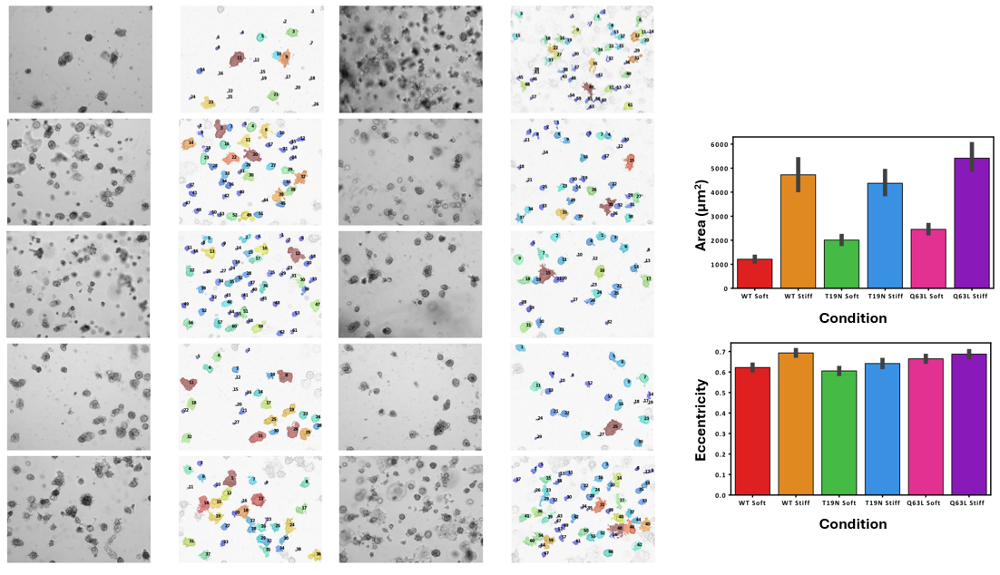

# Identifying Acini in Grayscale Images

Category: Grayscale
On Github?: No

The code contains two segmentation methods to identify and quantify acini (or any cellular aggregates) from 2D brightfield images:

1. Intensity-based method
    1. This method works best for WT MCF10A acini. However, if you’re having issues with the masks not aligning well with your cells, you can try method (2)
2. Edge-based method

The code aims to remove out-of-focus acini from the subsequent quantification

## Intensity-Based Segmentation

This function processes the i-th image within the specified directory using background subtraction, smoothing, thresholding, and morphological cleaning. 

Labelled segmentations of acini are generated and optionally overlaid onto the original images for visual inspection.

## Edge-Based Segmentation

This function applies Laplacian edge detection, combines it with intensity information, and refines the binary segmentation using morphological operations. 

Segmented regions are filtered based on solidity to exclude fragmented or non-compact objects.

Labelled segmentations of acini are generated and optionally overlaid onto the original images for visual inspection.

