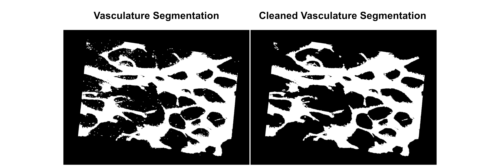

## Background

This code enables quantification of vasculature permeability in 3D images at two time points (t0, t>0).
Vasculature is segmented using a model classifier from [Hajal et al.](https://www.nature.com/articles/s41596-021-00635-w#Sec44)

## Code Explanation

1. Single FOVs are extracted from a lif. Intensity is compared at t0 and t2 (360 second interval)
2. Segmentation of the vasculature at t0 is performed using a model classifier from [Hajal et al.](https://www.nature.com/articles/s41596-021-00635-w#Sec44), therefore ImageJ is run in headless mode to perform segmentation with auto thresholding (Otsu) and erosion preprocessing as per the paper.
3. Identified vasculature is cleaned to remove small objects (noise)

4. Segmentation volume and area are calculated, along with permeability parameters
5. Permeability and interrim parameters are output in a dataframe.