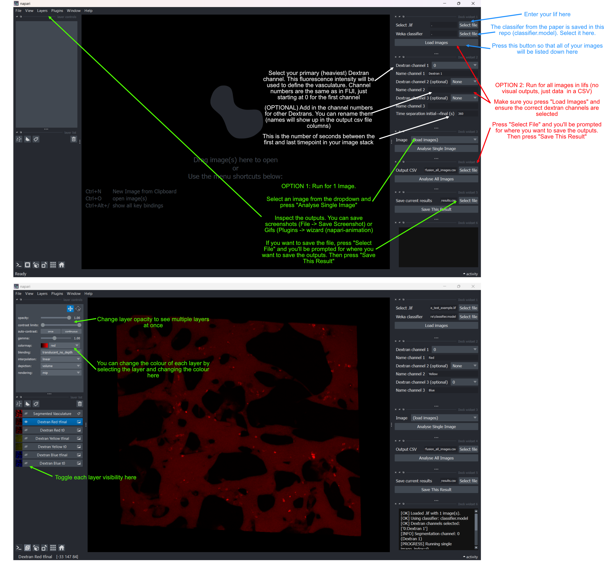

# Vasculature Perfusion Analysis

This notebook (`perfusion.ipynb`) provides a **Napari GUI** for quantifying dextran permeability from `.lif` timelapse volumes.

Vasculature segmentation uses a Trainable Weka classifier workflow based on the approach from [Hajal et al.](https://www.nature.com/articles/s41596-021-00635-w#Sec44), with preprocessing in Fiji/ImageJ.

## What the notebook does

For each selected image in a `.lif` file:

1. Loads 3D timelapse data (`T,Z,Y,X` or `T,C,Z,Y,X`).
2. Segments vasculature from the **first selected dextran channel at t0** using a Weka classifier from [Hajal et al.](https://www.nature.com/articles/s41596-021-00635-w#Sec44)
3. Cleans segmentation by removing connected components with area < 20 voxels.
4. Uses the cleaned vasculature mask to quantify intensities:
     - inside vasculature
     - outside vasculature (gel)
     - at `t0` and `tfinal`
5. Computes geometric terms (surface area and volumes) after z-to-x rescaling.
6. Calculates permeability:

$$
p = \frac{1}{t} \cdot \frac{V_{gel}}{A_{vasc}} \cdot \frac{(b\,I_{gel,t_{final}} - I_{gel,t0})}{(I_{vasc,t0} - I_{gel,t0})}
$$

where $b = I_{vasc,t0}/I_{vasc,t_{final}}$ is the bleaching coefficient and t is the time (seconds) between the first and last frame.

## GUI workflow

The app is created by instantiating `PerfusionNapariGUIApp()` and adds dock widgets in Napari:

- **Load images**
    - Select `.lif`
    - Select Weka classifier file
    - Click **Load images**
- **Dextran channel config**
    - Choose up to 3 dextran channels
    - Assign custom names per channel
    - Channel options are auto-populated from the `.lif` channel count
- **Analyse Single Image**
    - Select one image from dropdown
    - Runs quantification
    - Adds preview layers to Napari:
        - `Dextran <name> t0`
        - `Dextran <name> tfinal`
        - `Segmented Vasculature`
- **Analyse All Images**
    - Runs the same pipeline across all images in the loaded `.lif`
    - Saves results to CSV
- **Save This Result**
    - Saves currently accumulated results table to CSV

## Inputs

- A valid `.lif` file
- A valid Trainable Weka classifier file
- At least one selected dextran channel
- Images with at least 2 timepoints for permeability calculation

## Notes and assumptions

- Segmentation is always generated from the **first selected dextran channel**, then reused for all selected channels in that image.
- When channel counts vary across images in a `.lif`, unavailable channels are skipped per-image.

