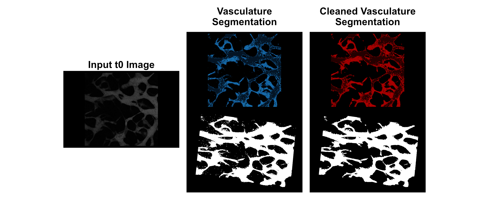

## Background

This code enables quantification of vasculature permeability in 3D images at two time points (t0, t>0 (in our experiment, this is referred to as t2)).
Vasculature is segmented using a model classifier from [Hajal et al.](https://www.nature.com/articles/s41596-021-00635-w#Sec44)

To install all the environment variables, just run conda env create -f yourfile.yml, where the yml file is contained in this repo. Once installed, run conda activate nap-ij.

## Code Explanation

1. Single FOVs are extracted from a lif.
2. Segmentation of the vasculature at t0 is performed using a model classifier from [Hajal et al.](https://www.nature.com/articles/s41596-021-00635-w#Sec44), therefore ImageJ is run in headless mode to perform segmentation with auto thresholding (Otsu) and erosion preprocessing as per the paper. 
    - This segmented region defines the vasculature at BOTH t0 and t2 (t>0)
3. Identified vasculature is cleaned to remove small objects (noise)

4. Volume and area are of the segmented region are calculated
5. Signal intensity inside and outside the identified vasculature is calculated at t0 and t2 (t>0)
5. Permeability is calculated and output (along with interrim) in a dataframe.

## Minimal Segmentation File
- This file allows you to perform segmentation and returns the t0 and t2 signal intensities, along with the segmented region
- These images can be viewed on Napari, where you can take screenshots or record moview
- To record movies, make sure you run the code on the nap-ij-record kernel